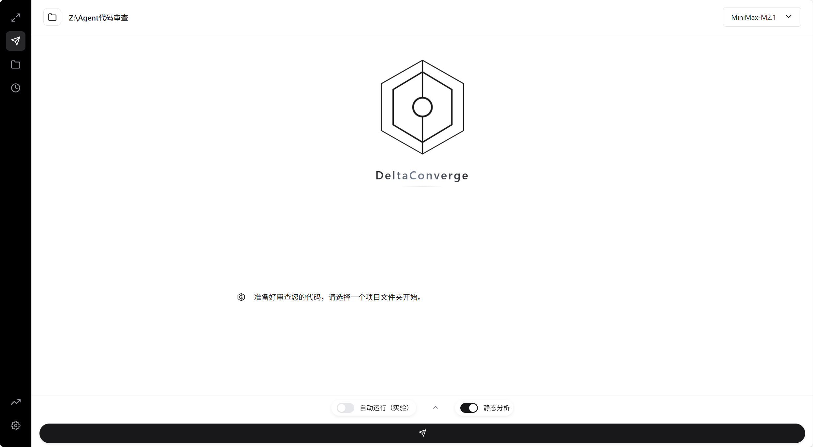

# 🥳 欢迎使用 DeltaConverge

每一次新功能、新优化的诞生都始于一次**背离**，代码的价值不在于孤立存在，而在于回归与融合。当分支发起 Pull Request，它必须经过审核，与主支的代码、团队的规范、产品的愿景 **Converge**（汇聚合一）。

DeltaConverge，捕获 PR 中每一个细微的 Delta，以清晰的分析引导它完成 Converge 的使命。

> *差异在此汇聚，代码因此完整*



##  它能做什么

- **智能感知变更**：自动检测你的代码改动，无需手动指定
- **理解项目意图**：分析项目文档和提交历史，让审查贴合业务场景
- **多Agent协同**：分析Agent、规划Agent、审查Agent串行协作，层层把关
- **动态上下文**：根据变更复杂度智能拉取相关代码，不多不少
- **流式输出**：实时展示审查过程，思考过程可见
- **自我学习**：追踪规则与LLM的分歧，持续优化规则库

##  快速开始

### 环境要求
- Python 3.12+
- Git 2.20+

### 方式一：本地运行（推荐）

本地运行通常拥有更好的性能与更低的 IO 开销（尤其在大仓库 Diff/文件扫描场景下）。

### 安装

```bash
# 克隆项目
git clone https://github.com/Gust-feng/DeltaConverge.git
cd DeltaConverge

# 创建虚拟环境
python -m venv venv
venv\Scripts\activate  # Windows
# source venv/bin/activate  # Linux/macOS

# 安装依赖
pip install -r requirements.txt
```

### 配置API密钥

1. 在项目根目录创建 `.env` 文件，配置你使用的模型密钥：

```bash
# 任选一个或多个配置即可
GLM_API_KEY=你的智谱API密钥
OPENROUTER_API_KEY=你的OpenRouter密钥
# 更多模型配置见 .env.example
```

2. 在前端仪表盘中添加

### 运行

**Web界面（推荐）**

```bash
python run_ui.py
```

**命令行**

```bash
python Agent/examples/run_agent.py --prompt "请审查本次改动" --auto-approve
#暂未进行参数优化
```

### 方式二：Docker（可选）

镜像地址：`gustfeng/deltaconverge` | [Docker Hub](https://hub.docker.com/r/gustfeng/deltaconverge)

```bash
docker run -d -p 54321:54321 -v /your/projects:/projects gustfeng/deltaconverge:2.81
```

> 将 `/your/projects` 替换为你的代码仓库目录，访问 `http://localhost:54321`，API密钥可在 Web 界面中配置。

## 📁 项目结构

```
├── Agent/          # 核心审查引擎
│   ├── agents/     # Agent实现（分析、规划、审查）
│   ├── core/       # 核心模块（API、LLM适配、上下文）
│   └── DIFF/       # Diff解析与规则匹配
├── UI/             # Web前端
└── etc/            # 文档与配置
```

## 📖 了解更多

- [欢迎使用](etc/欢迎使用.md) - 开发历程与设计思路
- [核心文档](etc/核心文档) - 系统架构详解
- [技术详解](etc/技术详解) - 实现细节

## 🤝 贡献

欢迎提交 Issue 和 Pull Request！

## License

本仓库当前未提供开源许可证（No license）。除非另行书面授权，默认保留所有权利（All rights reserved）。本项目主要用于比赛展示与学习交流。

---

*DeltaConverge - 让每一次代码汇聚都更有价值*
