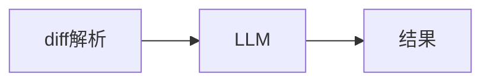
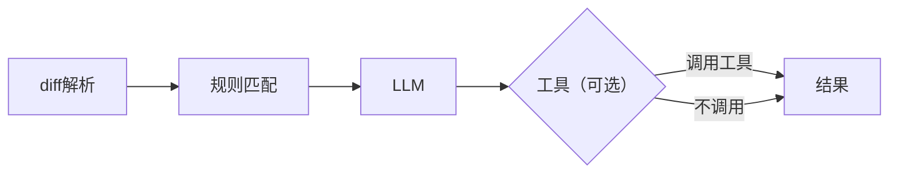
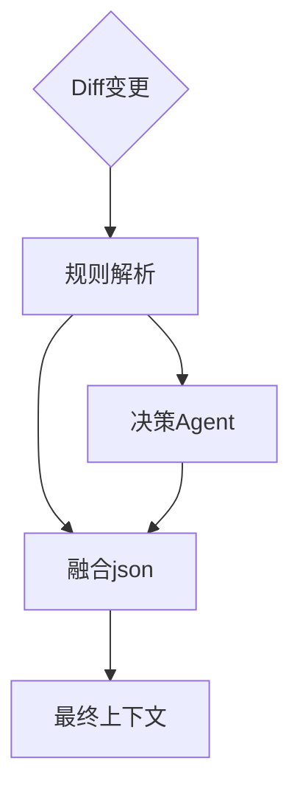
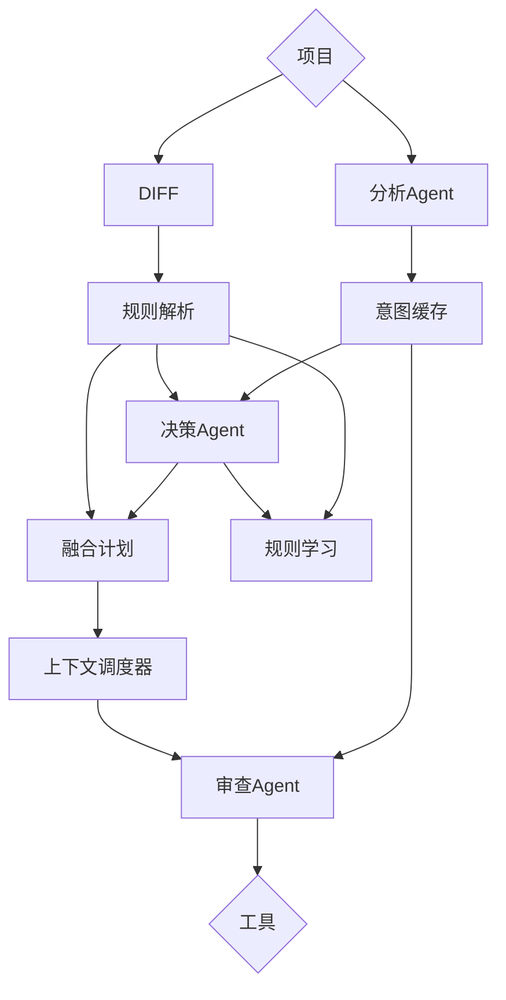
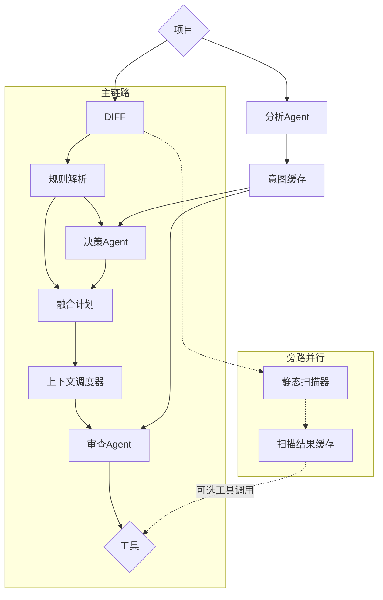

# V1.0

> 简单的反馈系统

* [x] 当前阶段：`Diff+LLM`

---

# v1.5

> [优化输入Diff信息](../存档/上下文的权衡/1_DIFF格式.md)，LLM支持调用工具动态分析问题

- [x] 当前阶段：`「单 Agent + 工具 + 规则驱动上下文」的代码审查引擎`

当前问题：

## 上下文策略

现在的策略本质是：

- 开头：把「整段 diff 概览 + 一些 JSON 摘要」一次性塞进首轮消息。

- 后续：不再自动补上下文，只让 LLM 自己用工具拉更多代码。
  - 消息：所有轮次、工具结果全堆 messages，不做裁剪、不做摘要。

  这带来几个问题：

1. **第一轮太胖**：首轮 prompt + diff 概览 已经吃掉大量 tokens，后面再加工具结果，很容易冲 tokens 上限。
2. **上下文调度是“放养模式”**：
     - LLM 要是“勤快”，就会疯狂 call 工具，tokens 爆炸。
   - 要是“懒”，就自己瞎猜，审查质量不稳定。
  3. **对话历史纯堆积**：没有“什么该留下、什么可以摘要”的策略，后续每轮都背负所有历史。
4. **注意力不集中**：当前链路是 system → user(含 diff markdown/json) → assistant → tool → assistant… 消息会累积；当总长度逼近模型上下文上限时，模型会截断最早的内容，或者虽未截断但权重变低，因此首条 diff 可能被遗忘或被忽略。

> 做到这里感受到单Agent的极限状态了，接下来考虑使用多Agent进行协作解决上下文问题

# V2.0

> 承认 LLM 只是引擎，代码审查由不同职能的Agent统筹进行

- [x] 当前阶段`规则解析+决策Agent共同调度上下文`

核心目标是：

1. 解析 diff → 结构化为 ReviewUnit
2. 基于规则层计算每个单元的上下文建议与置信度
3. 将“带置信度的索引”交给 LLM，让其判断：
   - 哪些单元需要被审查
   - 需要多深的上下文（函数/文件/调用方/旧版本等）
4. 将 LLM 决策融合规则层结果 → 生成最终上下文计划
5. 上下文调度器据此拉取代码片段 → 提供给审查 Agent

# V2.1(过渡版)

> 对链路进行全面改造升级，将系统功能模块化，并封装为内核

系统应该只进行纯粹的代码审查，不需要关注外部实现方法

这个版本抽象化将系统视作内核，对外提供API

# V2.5

> 内核全面升级，引入前端，各职能分工明确

- [x] 当前阶段：`多 Agent 内核 + 前端协同`

* 新增分析Agent：首次审查前生成项目业务/架构摘要，写入项目级意图缓存（可增量刷新），后续同一项目直接复用
* 规则模块解耦：按语言拆分解析器与规则集，降低新增语言成本，支持独立升级与热更新
* 规则学习机制：记录规则与 LLM 上下文决策冲突样本，定期迭代阈值/模式，持续提升置信度
* 代码扫描器融合：引入静态扫描结果作为辅助特征，参与置信度计算与上下文选择
* 前端升级：提供可视化流水线与 SSE 流式回放、工具调用审批与统计、会话管理与日志检索

扫描器应该是**增强**，而不是**前置硬依赖**，一来扫描器归一提供的元数据对决策Agent来说并不是必要的，二来将扫描器作为**前置扫描器 **需要足够的时间，这就意味着在扫描没跑完前，规则建议出不来，规则建议出不来，Planner的输入不完整，前端需要忍受很长的空白窗口期间，虽然这个空白窗口期可以通过将扫描器扫描情况实时渲染进行缓解，但这是不合理的

更好的思路是，按照先前的链路跑一遍，扫描器作为**异步补充**

# V2.8

> 在正式进行下一版升级前，对整个系统进行全面优化，升级功能，斟酌合适方案，修复潜在问题，此版本跨度极大

- [x] 当前阶段：`双链路并行，扫描器异步补充`

    

## 内核

* 规则学习机制：解决冲突信息未能正确保存问题
* 解耦链路依赖：将扫描器作为可选旁路并发运行
* 对接预留接口：取消参数硬编码，传参来自配置文件，并对外提供API
* 数据保存：新增扫描器数据保存，支持历史会话回看扫描器结果
* 优化文件代码：提高对不同系统兼容性，支持docker部署
* 优化规划时间限制：避免因LLM输出缓慢而截断
* 优化链路冲突：解决构建上下文包不及时发送问题
* 优化拉取策略：避免局部大量独立变更成为分散审查单元，优化合并逻辑，适配后两个阶段的拉取规则
* 新增扫描器工具：将扫描器结果可选被审查Agent调用
* 新增模型适配：对新发布模型进行及时适配

## 前端

* 意图分析：解决仪表盘进行意图分析模型调用回退问题，调整模型选择唯一机制，删除模型选择失败回退机制
* 规则优化：对细节进行优化，新增参考提示手册
* 新增git历史：支持选择项目后展示git提交历史
* 细节优化：优化动画效果，简化操作逻辑
* 添加缓存机制：减少请求频率，优化请求，确保手动刷新数据正常运行
* 接口错误：解决前端无法添加模型问题
* 提升匹配兼容性：避免LLM输出不符合预期导致无法正确在详细信息中映射

`此版本的设定是将整个系统收敛为一个功能完善，能够稳定运行的原型系统`

# V3.0

仔细研究了向量库的具体应用后，发现“为整个代码库构建向量库”理论上可行，但放在 PR 审查这个场景里，本质上在工程层面不合理、没必要、而且会拖垮整个系统性能。

但是——
向量库在“长期项目认知 / 跨文件知识”层面依然有用，只是不能放在实时审查链路里。

## 构建一个代码库的向量库需要
- 遍历所有文件
- embedding 所有函数/类
- 写入向量数据库
- 这一步对大型代码库（>3万行）耗时：几秒到几十秒，甚至几分钟

## 而 PR 审查的要求是
- ➤ 改了两行代码
- ➤ 马上给结果
- 审查系统不能每次 PR 都重新构建全量向量库。

## PR 审查只需要小范围上下文，不需要全库语义搜索
- PR 的核心需求是：
  - 我改了什么
  - 影响哪里
  - 周边上下文是什么
  - 相关调用链是什么
- 这些信息：规则层 + 轻量静态分析就足够了。

## 向量检索像是
- “我要找到语义上相似的函数/模式”
- 但 PR 审查不是在找“相似函数”，是在找“关联函数”。
- 两者完全不同。
- 结构化代码分析 ≫ 向量搜索

## 代码不适合做 “全量 embedding → 语义检索”
- 因为：
  - 两段代码语义类似 ≠ 它们之间存在真实调用/依赖关系
  - embedding 算法对代码依赖极度不敏感
  - 搜索结果往往不相关
  - 会带来大量噪音
  - 反而误导审查 Agent
- 你要的是准确性，不是泛搜索。

## 那向量库到底该不该做？
- 该，但不是现在 
- 真正合理的方式是：
  - 用向量库做“长期项目记忆（Project Memory）”
  - 可以做一个异步的、间歇式的、非实时向量库：

### 用途包括
- 跨文件知识的补全
- 团队惯用模式识别
- 项目架构理解（长期累计）
- Function/Class 索引
- “相关模块”的辅助判断
- 非 PR 场景的智能 IDE 助手能力

### 最合理的设计是“两层式”
- 第一层（实时审查层）— 不用向量库
  - 适用于 PR 审查、提交前审查
  - 来源：
    - diff
    - 函数/类上下文
    - 同文件 / 同模块文件
    - 规则层关联文件
    - 工具调用 (read_file/search/scanner)
  - 这部分必须：
    - 轻量
    - 确定性
    - 快
    - 可控
- 第二层（后台语义层）— 向量库 + 长期索引
  - 适用于：
    - IDE 整体项目理解
    - 复杂审查的高级模式
    - 多 Agent 的长期知识
    - 跨文件语义引用
    - 项目级建议（架构问题、一致性问题）
  - 这个层可以异步构建：
    - 每次代码库变化时刷新部分 embedding
    - 每日一次增量构建
    - 或者手动触发
  - 供 Agent 在需要时调用：
    - “给我找跟这个类相关的实现模式”
    - “找一下类似函数是怎么处理异常的”
    - “找与这个API相似的模块”

### 总结：
- 向量库 ≠ PR 审查上下文的核心
- 向量库 = “长期语义记忆”
- 实时审查靠规则、diff、结构化上下文；
- 长期智能靠向量检索。
- 所以将向量库构建设计在第三版
