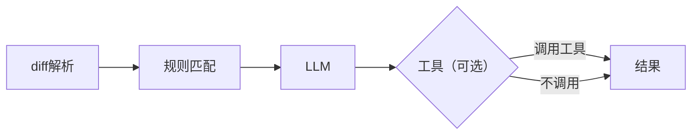

# V1.0<sub>(最小MVP)</sub>

> 简单的反馈系统

* [x] 当前阶段：`Diff+LLM`


---

# v1.5

> [优化输入Diff信息](etc\上下文的权衡\1_DIFF格式.md)，LLM支持调用工具动态分析问题

- [x] 当前阶段：`「单 Agent + 工具 + 规则驱动上下文」的代码审查引擎`


当前问题：

## 上下文策略

现在的策略本质是：

- 开头：把「整段 diff 概览 + 一些 JSON 摘要」一次性塞进首轮消息。

- 后续：不再自动补上下文，只让 LLM 自己用工具拉更多代码。
  - 消息：所有轮次、工具结果全堆 messages，不做裁剪、不做摘要。

  这带来几个问题：

1. **第一轮太胖**：首轮 prompt + diff 概览 已经吃掉大量 token，后面再加工具结果，很容易冲 token 上限。
2. **上下文调度是“放养模式”**：
     - LLM 要是“勤快”，就会疯狂 call 工具，token 爆炸。
   - 要是“懒”，就自己瞎猜，审查质量不稳定。
  3. **对话历史纯堆积**：没有“什么该留下、什么可以摘要”的策略，后续每轮都背负所有历史。
4. **注意力不集中**：当前链路是 system → user(含 diff markdown/json) → assistant → tool → assistant… 消息会累积；当总长度逼近模型上下文上限时，模型会截断最早的内容，或者虽未截断但权重变低，因此首条 diff 可能被遗忘或被忽略。

> 做到这里感受到单Agent的极限状态了，接下来考虑使用多Agent进行协作解决上下文问题

# V2.0

> 承认 LLM 只是引擎，代码审查由不同职能的Agent统筹进行

------

# 1. 总体目标

本版本的核心目标是：

1. 解析 diff → 结构化为 ReviewUnit
2. 基于规则层计算每个单元的上下文建议与置信度
3. 将“带置信度的索引”交给 LLM，让其判断：
   - 哪些单元需要被审查
   - 需要多深的上下文（函数/文件/调用方/旧版本等）
4. 将 LLM 决策融合规则层结果 → 生成最终上下文计划
5. 上下文调度器据此拉取代码片段 → 提供给审查 Agent

流程图概述：

```
diff → ReviewUnit → 规则层 → review_index → LLM 规划 → 融合 → ContextProvider → 审查
```

------

# 2. ReviewUnit 构建（Diff 解析层）

负责模块：`DIFF/diff_collector.py`

职责：

- 使用 PatchSet 将 diff 划分为按文件/按 hunk 的 ReviewUnit
- 生成 tags（security_sensitive / only_comments / routing_file 等）
- 生成 metrics（added/removed、hunk 数量、是否在单一函数）
- 识别 patch_type（add / delete / modify）
- 输出结构化的 ReviewUnit 列表

示例结构：

```
ReviewUnit {
  unit_id,
  file_path,
  patch_type,
  tags: [...],
  metrics: { ... },
  ...
}
```

此阶段不涉及 LLM。

------

# 3. 规则层（Rule Layer）

负责模块：`DIFF/rule/context_decision.py`

规则层基于 ReviewUnit 的 tags 与 metrics，输出两个关键字段：

- **rule_context_level**：规则建议的上下文深度
  - diff_only / function / file_context / full_file
- **rule_confidence**：规则对该建议的信心
  - 0〜1 的数值，越高代表规则越肯定

规则层的职责：

- 给出“默认的上下文范围”
- 标记哪些单元风险高（如 security_sensitive）
- 提供“LLM 是否需要介入”的依据

规则层不做语义判断，仅提供结构判断与经验判断。

------

# 4. review_index（审查索引）

负责模块：`Agent/core/context/diff_provider.py`

review_index 是 LLM 在规划阶段的唯一输入数据结构，不包含任何代码内容。

结构示例：

```
review_index = [
  {
    unit_id,
    file_path,
    patch_type,
    tags,
    metrics,
    rule_context_level,
    rule_confidence
  },
  ...
]
```

review_index 的用途：

- 代表了整份 diff 的结构特征
- 作为 LLM 规划层的输入，用于判断哪些单元需要审查、需要多深上下文
- 避免把完整 diff 放进模型 → 实现“轻量规划”

------

# 5. LLM 规划层（Planning Agent）

输入：review_index（无任何代码）

输出：针对每个关心的 ReviewUnit 的上下文建议：

```
{
  unit_id,
  llm_context_level,     // function / file_context / full_file
  extra_requests: [...], // callers / previous_version / search
  skip_review: false     // 可选
}
```

LLM 的任务：

- 判断哪些单元需要进入审查
- 判断每个单元是否需要：
  - 函数级上下文
  - 文件局部上下文
  - 调用方信息
  - 旧版本对照
  - 其他特定上下文

LLM 此阶段不做“审查问题”本身，仅做“上下文决策”。

------

# 6. 决策融合（规则层 + LLM）

本阶段将规则层和 LLM 的建议进行合并，生成最终的上下文计划。

## 6.1 融合输入

对于每个 ReviewUnit：

- 规则层：`rule_context_level`, `rule_confidence`
- LLM：`llm_context_level`, `extra_requests`

## 6.2 阈值定义

```
T_HIGH = 0.8
T_LOW  = 0.5
```

## 6.3 主上下文层级融合

使用上下文深度顺序：

```
diff_only (0)
function  (1)
file_context (2)
full_file (3)
```

融合策略：

### 1）高置信度：rule_confidence >= T_HIGH

- 若 LLM 要求更深 → 取 LLM
- 否则 → 用规则层的 rule_context_level

### 2）低置信度：rule_confidence <= T_LOW

- 若 LLM 有建议 → 用 LLM 的 llm_context_level
- 若 LLM 无建议 → 至少维持 rule_context_level

### 3）中间区间：T_LOW < rule_confidence < T_HIGH

- 如果 LLM 更深 → 采纳 LLM
- 如果 LLM 更浅 → 取更深的一侧（规则更保守）
- 一致 → 原封不动

## 6.4 附加需求融合（extra_requests）

规则层一般不给附加需求 → 直接合并 LLM 的 extra_requests。

## 6.5 最终输出

```
final_context_plan = [
  {
    unit_id,
    final_context_levels: [...],
    final_extra_requests: [...]
  }
]
```

------

# 7. 上下文调度器（ContextProvider）

最终上下文计划将交由 ContextProvider 执行。

任务：

- 根据 final_context_levels 调用工具：
  - read_file_hunk
  - read_function_body
  - search_callers
  - git_show(previous_version)
- 按需裁剪和拼接上下文
- 去重与缓存
- 输出 ContextBundle

结构示例：

```
ContextBundle = [
  {
    unit_id,
    diff,
    function_context,
    file_context,
    callers,
    previous_version
  }
]
```

ContextBundle 会作为审查层 LLM 的输入。

------

# 8. 审查层（Reviewer LLM）

Reviewer 接受 ContextBundle，做真正的语义审查：

- 查找 bug、逻辑错误、安全隐患
- 若上下文不足，会发出 need_xxx 请求
- 这些请求再次交给上下文调度器执行（可多轮）

注意：此阶段与规划层完全分离。

------

# 9. 工具层与 LLM 审查融合（可选）

若集成静态工具（例如 ESLint、Bandit、AST 规则）：

- 可对同一单元生成工具 findings
- 审查层 LLM 的 findings 与工具 findings 送入融合层合并输出

策略：

- 双方都发现 → 合并为高置信度 issue
- 仅工具发现 → 强信号输出 / 弱信号降级
- 仅 LLM 发现 → 正常输出，并记录为规则层未来增强候选

此机制支持系统自我进化。

------

# 10. 完整链路示例

```
Diff 解析 → ReviewUnit →
规则层（加置信度）→ review_index →
LLM 规划层（给上下文意见）→ 融合 → final_context_plan →
ContextProvider（拉代码）→ ContextBundle →
Reviewer（语义审查）→ issues → 融合 → 最终输出
```

------


# 3.0

仔细研究了向量库的具体应用后，发现“为整个代码库构建向量库”理论上可行，但放在 PR 审查这个场景里，本质上在工程层面不合理、没必要、而且会拖垮整个系统性能。

但是——
向量库在“长期项目认知 / 跨文件知识”层面依然有用，只是不能放在实时审查链路里。

1. 构建一个代码库的向量库需要：

遍历所有文件

embedding 所有函数/类

写入向量数据库

这一步对大型代码库（>3万行）耗时：

几秒到几十秒

甚至几分钟

而 PR 审查的要求是：

➤ 改了两行代码
➤ 马上给结果

审查系统不能每次 PR 都重新构建全量向量库。

2. PR 审查只需要小范围上下文，不需要全库语义搜索

PR 的核心需求是：

我改了什么

影响哪里

周边上下文是什么

相关调用链是什么

这些信息：

规则层 + 轻量静态分析
就足够了。

向量检索像是：

“我要找到语义上相似的函数/模式”

但 PR 审查不是在找“相似函数”，
是在找“关联函数”。

两者完全不同。

结构化代码分析 ≫ 向量搜索

3. 代码不适合做 “全量 embedding → 语义检索”

因为：

两段代码语义类似 ≠ 它们之间存在真实调用/依赖关系

embedding 算法对代码依赖极度不敏感

搜索结果往往不相关

会带来大量噪音

反而误导审查 Agent

你要的是准确性，不是泛搜索。

## 那向量库到底该不该做？

该，但不是现在 

真正合理的方式是：

用向量库做“长期项目记忆（Project Memory）”

可以做一个异步的、间歇式的、非实时向量库：

用途包括：

跨文件知识的补全

团队惯用模式识别

项目架构理解（长期累计）

Function/Class 索引

“相关模块”的辅助判断

非 PR 场景的智能 IDE 助手能力

而不是：

 每个 PR 审查都实时构建并查向量库

 最合理的设计是“两层式

第一层（实时审查层）— 不用向量库

适用于 PR 审查、提交前审查

来源：

diff

函数/类上下文

同文件 / 同模块文件

规则层关联文件

工具调用 (read_file/search/scanner)

这部分必须：

轻量

确定性

快

可控

第二层（后台语义层）— 向量库 + 长期索引

适用于：

IDE 整体项目理解

复杂审查的高级模式

多 Agent 的长期知识

跨文件语义引用

项目级建议（架构问题、一致性问题）

这个层可以异步构建：

每次代码库变化时刷新部分 embedding

每日一次增量构建

或者手动触发

供 Agent 在需要时调用：

“给我找跟这个类相关的实现模式”

“找一下类似函数是怎么处理异常的”

“找与这个API相似的模块”


### 总结：

向量库 ≠ PR 审查上下文的核心
向量库 = “长期语义记忆”

实时审查靠规则、diff、结构化上下文；
长期智能靠向量检索。

所以将向量库构建设计在第三版
